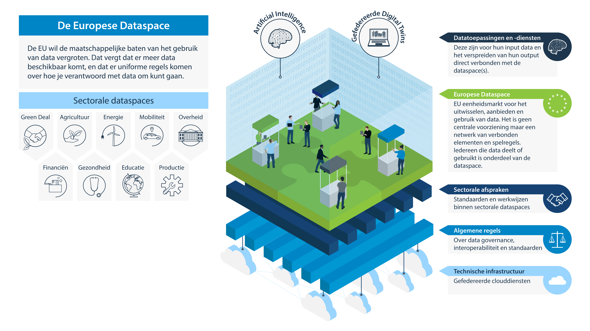

## European Data Spaces (*Dataruimten*)

Er wordt een 'eenheidsmarkt voor data' gecreëerd, die vorm krijgt in de vorm van een EU-brede data space (*dataruimte*). De EU-brede data space is waar alle aspecten uit de hiervoor genoemde Verordeningen tot praktische uitdrukking komen. Het is niet een vraag of je als data-gebruikende of data-delende deel wilt nemen aan de EU dataspace. De EU-brede dataspace is de omgeving waarin je data-gebruik en -delen plaatsvindt, binnen de randvoorwaarden en afspraken die voor die marktomgeving gelden. Met de EU data space wordt het bestaande vrije verkeer van personen, goederen en kapitaal aangevuld met het vrije verkeer van data.

Binnen zo'n data space moet het mogelijk zijn voor iedereen deel te nemen aan het delen, uitwisselen, en gebruiken van data. Ook als het gaat om data die je niet rechtstreeks kunt krijgen, worden er mogelijkheden voorzien om die data wel te kunnen gebruiken. Denk hier o.a. de overheidsdata die binnen de [Data Governance Act (DGA)](#data-governance-act-dga) valt, maar niet onder de [Open Data Directive](#open-data-directive) (en dus het openbaarheidsregime van de betreffende lidstaat). Zoals bijvoorbeeld het gebruiken van microdata van het CBS om een model te trainen zonder zelf over die microdata te hoeven beschikken, door het model naar de data te brengen.

Wat een data space precies is en hoe het zal worden, krijgt middels een  geleidelijk ontstaansproces vorm, waarbij bestaande en nieuwe elementen worden gefedereerd en verbonden. Op basis van bestaande beschrijvingen is een dataspace opgebouwd uit:
* een technische infrastructuur die voor iedereen toegankelijk is en veilige uitwisseling en gebruik mogelijk maakt. Dit is voorzien als een gefedereerde cloud-omgeving (hier is een relatie met bijvoorbeeld Gaia-X [^1]). 
* gereedschappen voor gebruik en delen
* generieke data governance afspraken en standaarden, waarin de Data Innovation Board uit de Data Governance Act (DGA) een rol speelt, en sectorale governance afspraken die gangbaar zijn binnen een toepassingsgebied
* heldere gebruikscondities (deels nader uitgewerkt in de komende [Data Act](#data-act-da))

T.a.v. de generieke aspecten van een dataspace publiceren we de [Verkenning dataspaces](https://docs.geostandaarden.nl/eu/VerkenningDataspaces/).

De manier waarop de EC de eenheidsmarkt voor data wil vormen, is middels sectorale data spaces, die vervolgens onderling interoperabel zijn. 
Binnen sectoren en thema's zijn er vaak meer al geldende afspraken t.a.v. standaarden en professionele normen t.a.v. omgang met data, die telkens gebaseerd zijn op de context van die sector. Een data space bouwt daar dan op voort, zowel om dubbel werk te voorkomen als om de vorming van dataspaces te versnellen.

Op Europees niveau worden de volgende thema's genoemd als sectorale dataspaces, waarop ook acties zijn ingezet:

* Gezondheid
* Mobiliteit
* Industrie
* Financiële diensten
* Energie
* Landbouw
* Green Deal
* Overheid
* Vaardigheden (onderwijs en arbeidsmarkt)
* Wetenschap
- Cultureel erfgoed
- Toerisme
- Media
- Taal

Verder worden ook circulaire economie en smart communities als mogelijk thema voor een Europese sectorale data space genoemd.

Ook wordt gesproken over de 'persoonlijke data space', die het mogelijk maakt om als individu of organisatie gegevens voor een specifiek gebruiksgeval (tijdelijk) in te brengen. (Een voorbeeld zou kunnen zijn, dat je je eigen mobiliteitsgegevens meeneemt naar een discussie over een nieuwe busroute of rondweg in je wijk). Vanuit een persoonlijke data space kan ook het in de [Data Governance Act (DGA)](#data-governance-act-dga) genoemde 'data-altruïsme' worden vormgegeven. Data-altruïsme is het beschikbaar stellen van gegevens voor algemeen nut aan een beherende erkende organisatie die toeziet op het juiste gebruik van die gegevens. 

Meer details  over de sectorale dataspaces zijn te vinden in het hoofdstuk [Uitwerking van de Dataspaces](#uitwerking-van-de-dataspaces). Voor generieke informatie over zichtbare algemene data space initiatieven zie ook de [Verkenning dataspaces](https://docs.geostandaarden.nl/eu/VerkenningDataspaces/).

Open data, zoals de [High Value Data lijst](#high-value-data-lijst) uit de Open Data Directive, en bronnen als [INSPIRE](#inspire-richtlijn) voeden de data space.

[^1]: [GAIA-X](https://www.gaia-x.eu/) is een project om een efficiënte en concurrerende, veilige en betrouwbare data-infrastructuur voor de Europese Unie te ontwikkelen. Het is een Frans-Duits initiatief met een Europese dimensie, gesteund door 22 bedrijven. Het project werd officieel gelanceerd op 4 juni 2020.
