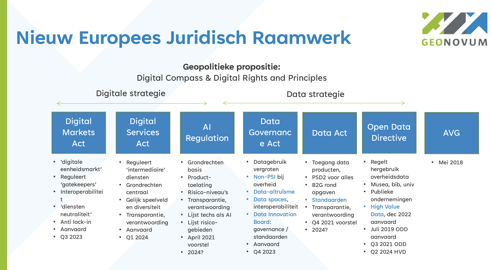

## EU neemt geopolitieke positie in

De EU neemt m.b.t. de rol van digitalisering en data een geopolitieke positie in.
Die positie richt zich tegelijkertijd op het maximeren van maatschappelijk nut van digitalisering en datagebruik en het beschermen en versterken van de individuele rechten van mensen.

Dit in contrast tot uitgangsposities elders in de wereld die bijvoorbeeld eenzijdig gericht zijn op waarde extractie of op het centraliseren van controle. Daarmee is het ook een _propositie_ van de EU aan de wereld, een uitnodiging op gelijksoortige manier als de EU naar digitalisering en data te kijken.

Die geopolitieke propositie wordt in uitgangspunten, en twee strategieën met daaronder een aantal wetten vaste vorm gegeven. Onderstaande afbeelding geeft hiervan een overzicht. In de rest van deze handreiking wordt elk van de elementen nader beschreven.

### Digital Compass en Digital Rights and Principles
De uitgangspunten voor de geopolitieke propositie zijn vastgelegd in het EU Digital Compass en de EU Digital Rights and Principles ([bron](https://ec.europa.eu/info/strategy/priorities-2019-2024/europe-fit-digital-age/europes-digital-decade-digital-targets-2030_nl)).

De Europese visie op digitale transformatie zet de mens centraal, wil individuen handelingsvermogen geven, en innovatieve bedrijven aanmoedigen.
De Europese vorm van digitale transformatie wil digitale soevereiniteit, inclusiviteit, gelijkheid, duurzaamheid, veerkracht, veiligheid, vertrouwen, levenskwaliteit, respect voor burgerrechten en menselijke aspiraties omvatten, en wil bijdragen aan een dynamische eerlijke maatschappij en economie.

Het EU Digitaal Compass geeft vier assen aan waarvoor doelstellingen per 2030 zijn geformuleerd.
Die vier assen zijn:
1. Een digitaal vaardige bevolking, en zeer vaardige digitale professionals
2. Veilige, goed presterende en duurzame digitale infrastructuren
3. Digitale transformatie van bedrijven
4. Digitalisering van publieke dienstverlening

Digitaal burgerschap is gebaseerd op het bestaande [Handvest grondrechten in de EU](https://eur-lex.europa.eu/legal-content/NL/TXT/HTML/?uri=CELEX:12012P/TXT&from=EN). 

In de EU Digital Rights and Principles wordt beschreven hoe die grondrechten en de Europese waarden toegepast moeten worden in de digitale wereld. Het dient als referentie voor bedrijven en andere actoren in het ontwikkelen en implementeren van technologie. Het is ook een gids voor beleidsmakers. De implementatie van deze rechten en principes is een verantwoordelijkheid van zowel de EU als van Lidstaten. In het jaarlijkse rapport 'State of the Digital Decade' wordt de monitoring van de digitale principes en rechten opgenomen.

#### Rechten:
- Recht op onderwijs, training en levenslang leren 
- Recht op eerlijke, gezonde en veilige werkomstandigheden, en passende bescherming in de digitale werkomgeving zoals ook op de fysieke werkplek, ongeacht werknemerstatus, werkvorm of arbeidsduur. Dit betekent ondermeer de mogelijkheid om offline te gaan, en het bewaken van werk-prive balans in de digitale omgeving.
- Recht op vrijheid van meningsuiting online, zonder angst voor censuur of intimidatie
- Recht op de bescherming van persoonsgegevens online, inclusief het recht op hoe iemand's data wordt gebruikt en met wie die wordt gedeeld (zie de AVG)
- Recht op de vertrouwelijkheid van communicatie (digitaal briefgeheim) en van gegevens op digitale apparaten, en recht niet te worden onderworpen aan wederrechtelijke surveillance of afvangactiviteiten.

#### Beginselen:
* Universele toegang tot technologie die verbindt en mensen niet van elkaar verwijdert. Dit betekent:
	- Zorgen dat technische oplossingen burgerrechten respecteert, de uitoefening van die rechten mogelijk maakt, en inclusiviteit uitdraagt
	- Zorgen dat ouderen, mensen met een beperking, gemarginaliseerden, kwetsbaren en ontrechten niet worden achter gelaten
	- Zorgen voor randvoorwaarden waardoor alle marktpartijen hun sociale verantwoordelijkheden nemen en naar vermogen bijdragen aan publieke goederen, diensten en infrastructuur 
* Universele toegang tot betaalbare digitale verbindingen van hoge snelheid, en internetneutraliteit 
* Universele digitale vorming en vaardigheden zodat mensen een actieve rol in de maatschappij kunnen nemen
* Universele online toegang tot alle belangrijke publieke diensten. Niemand zou meer data moeten worden gevraagd dan noodzakelijk voor toegang en gebruik van digitale publieke diensten. Dit betekent een toegankelijke, veilige en betouwbare digitale identiteit, brede toegang tot en hergebruik van overheidsinformatie, en naadloze veilige interoperabele toegang tot digitale zorgdiensten in de hele EU
* Toegang tot de voordelen van het gebruik van AI, op basis van eigen geïnformeerde keuzes, en bescherming tegen risico's m.b.t. gezondheid, veiligheid en fundamentele rechten. (UItgewerkt in de AI Verordening) Dit betekent:
	- Transparantie in het gebruik van AI en algoritmen, en het actief informeren van mensen die hiermee te maken krijgen.
	- Zorgen dat algoritmes gebaseerd zijn op geschikte datasets, om onwettelijke discriminatie tegen te gaan, en menselijke supervisie mogelijk te maken op uitkomsten die mensen raken.
	- Zorgen dat algoritmes en AI niet worden gebruikt om mensen keuzes op te leggen m.b.t. bijvoorbeeld gezondheid, onderwijs, werk, en in hun priveleven.
	- Zorgen voor vereisten waardoor AI en digitale systemen veilig zijn en mensen- en burgerrechten volledig respecteren.
* Vrije keuze in online diensten, gebaseerd op objectieve, transparante informatie. Dit betekent ondermeer eenvoudig persoonlijk gegevens mee kunnen nemen naar een andere online dienst (data-portabiliteit)
* Toegang tot betrouwbare, diverse en meertalige online omgevingen. Diversiteit in content draagt bij aan een pluralistisch publiek discours, en maakt brede deelname aan democratie mogelijk. Dit betekent ondermeer desinformatie en illegale content tegengaan, zonder het recht op meningsuiting aan te tasten en zonder algemene monitoring verplichtingen
* Mogelijkheid voor iedereen om te kunnen achterhalen wie de media die ze benutten bezit of bestuurt.
* Universele toegang tot digitale diensten die veilig en privacybeschermend zijn _by design_. Dit betekent ondermeer het beschermen van digitale identiteiten tegen identiteitsfraude.
* Universele digitale wilsbeschikking t.a.v. wat met publieke digitale informatie na iemands dood moet gebeuren.
* Toegang tot heldere informatie over de milieu-impact en het energieverbruik van digitale producten en diensten, om verantwoorde keuzes mogelijk te maken.
* Kinderen en jongeren verdienen zowel bescherming als de mogelijkheid tot vrije keuze en expressie online

Deze rechten en uitgangspunten waren in de zomer van 2021 onderwerp van een publieke consultatie. De EC heeft op 26 januari 2022 de [inhoud van de digitale rechten en principes](https://digital-strategy.ec.europa.eu/en/library/declaration-european-digital-rights-and-principles) voorgesteld, met de uitnodiging aan de Raad en het EP deze mede te ondertekenen.

### Twee strategieën als bouwstenen
Twee strategieën zetten deze propositie om in praktijk en regelgeving: 
* [De Europese digitale strategie](https://geonovum.github.io/eu_regelingen_datastrategie/#europese-digitale-strategie), en 
* [De Europese datastrategie](https://geonovum.github.io/eu_regelingen_datastrategie/#data-strategie).
